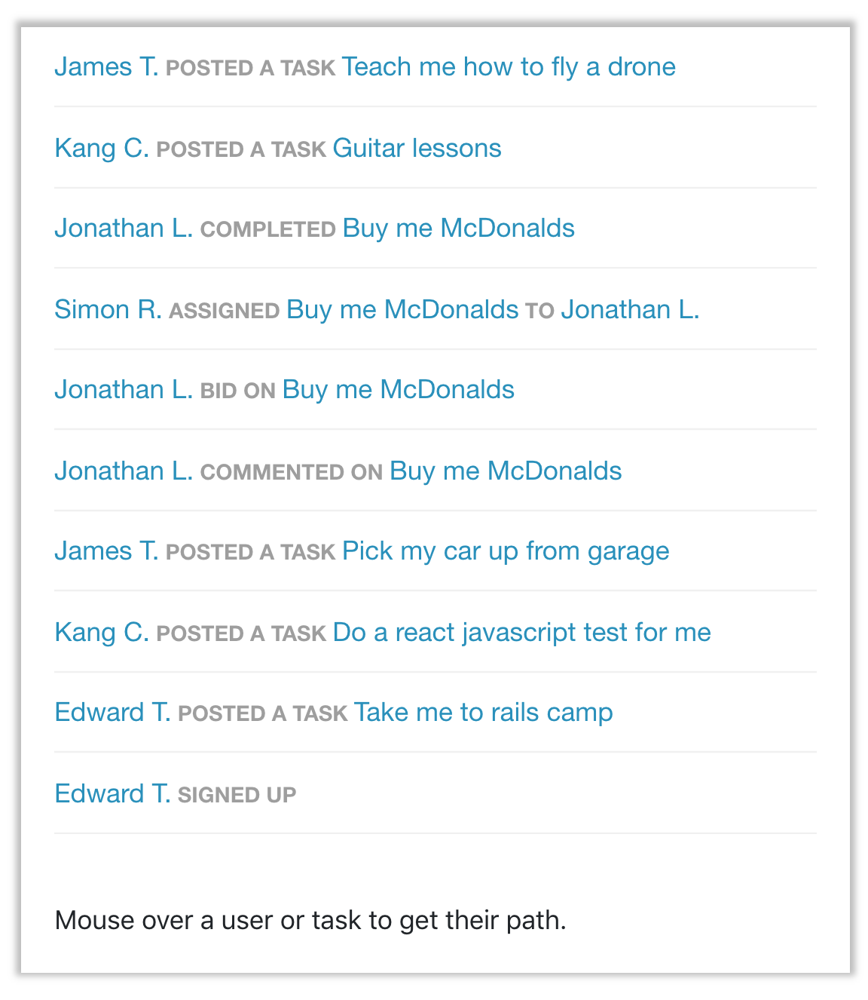
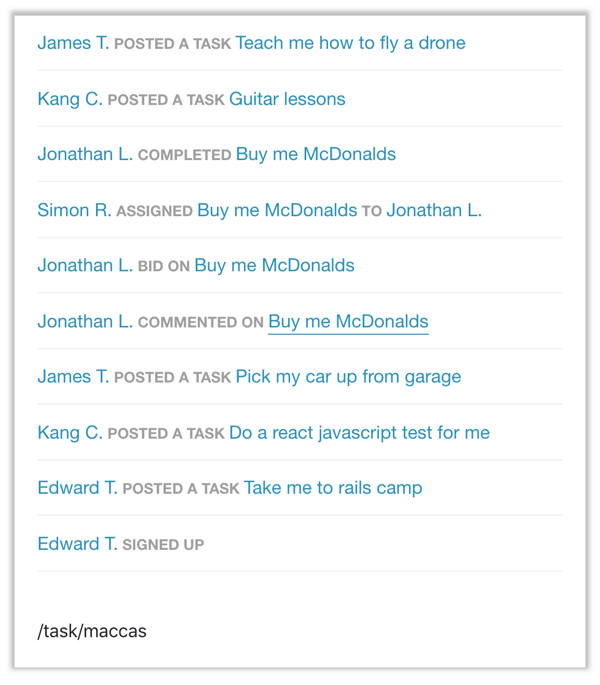
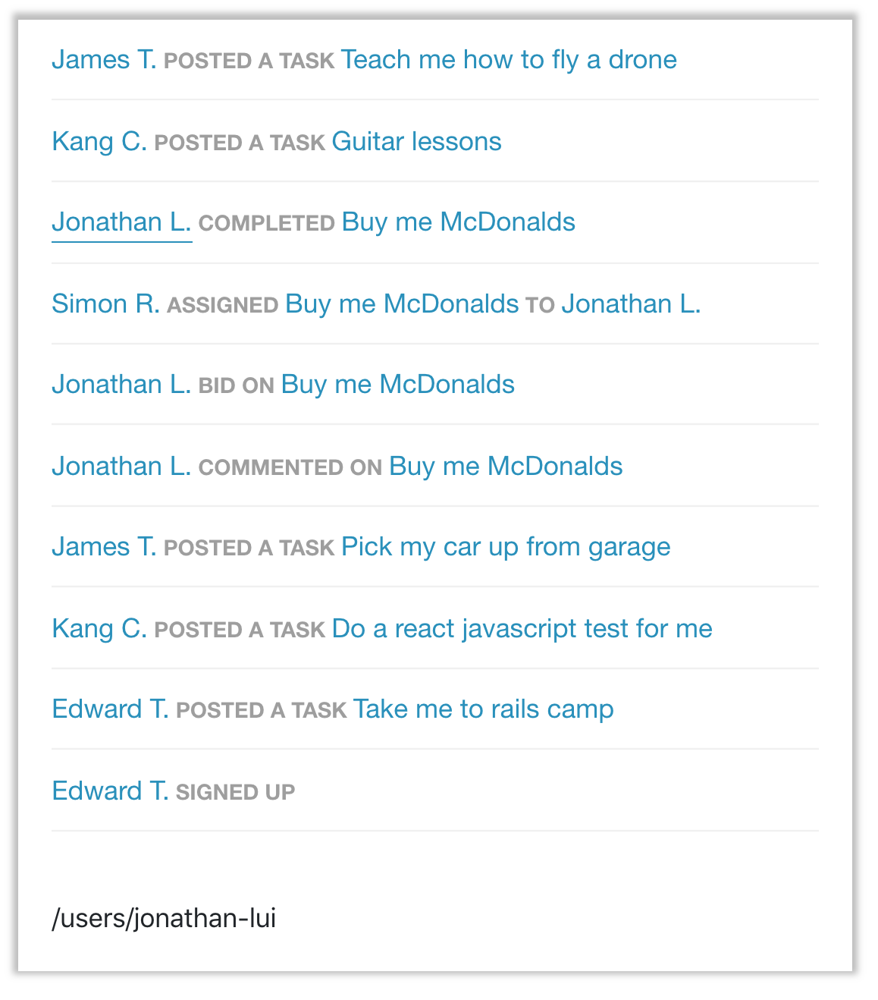
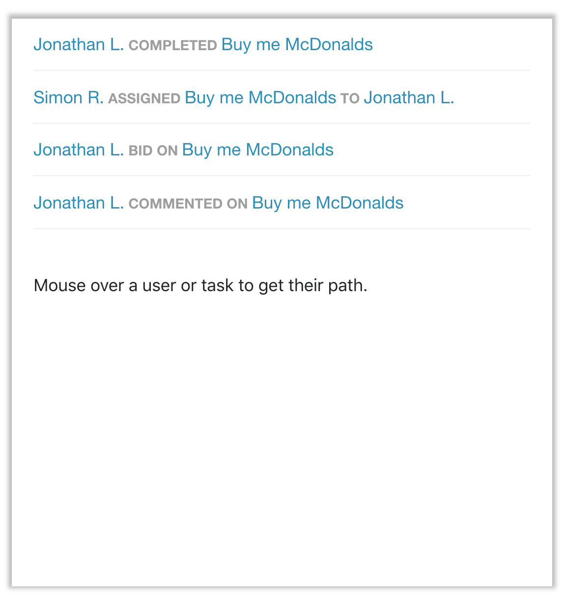
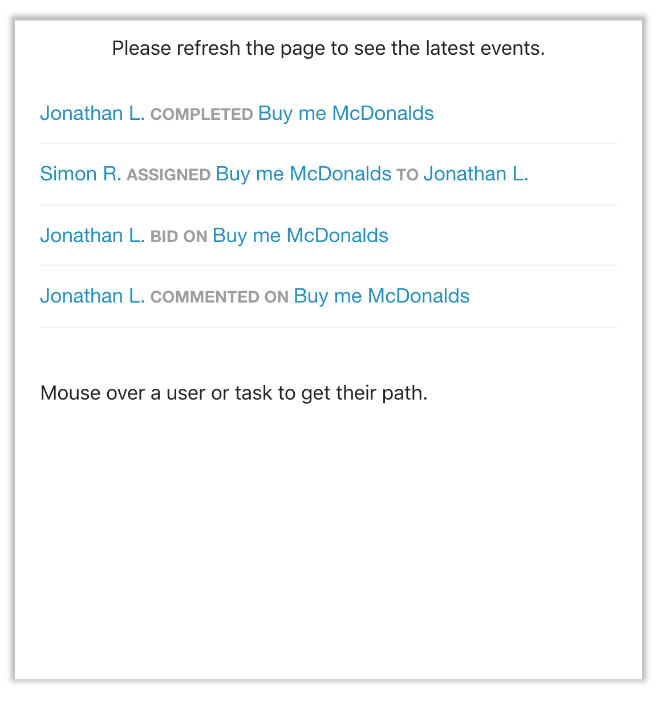

# Tasker

## Background

### Motivation

Having had ReactJS on my list of things to learn for a while now, I figured the Tasker front-end challenge was the perfect reason (read: induced motivation) to delve into this popular not-framework JS library.

Coming from a mostly backend background of late (Java, Python), I went through Codecademy's ReactJS I and II courses over the span of a couple of days to gain some exposure to ReactJS. From there, a combination of StackOverflow questions, Medium.com articles, github repo README files, NPM packages and good old W3C.org served as my resources.

### Scope

The challenge or task was to replicate an activity feed that was shown in an image.

As I starting thinking about this, I asked myself questions like:

* How would I package this for production deployment?
* What testing framework should I use?
* Should I write a lightweight API to support the one (or two, or three, or four at max) endpoint/s the JSON data would be retrieved by?
* Is Backbone.js the framework I should use for the models?

Diving into research around the questions above was relatively overwhelming (mainly the Backbone.js one) - there's a lot to read out there, and despite having heard that Backbone.js is something Airtasker potentially uses in combination with React, the internet didn't think this to be a common or recommended occurrence, so it was hard to grasp how Backbone would fit in with React when I was unfamiliar with both, and resources were light.

I eventually managed to pull myself back and decided *not* to focus on some of the items above, in light of the amount of time it would take me to get up to speed with Backbone.js and all the other considerations (I was told that completing the challenge is typically meant to take about 5 hours).

I limited my scope to focusing on the plain ReactJS code and components, along with the CSS styling necessary to appease the perfectionist in me (note: I restrained myself from finding the exact font and colours in the images I was meant to replicate), but the adventurer/'user' in me did want to see a more fully-fledged activity feed solution that would make sense in terms of usage in the real world.

# App/Solution

## Behaviour

I initially kept the behaviour of the components fairly simple, mimicking the things I could see visually, and then expanded upon what I had to implement 'wishlist' items.

Additional behaviours that may be of note are as follows:

* Activity feed items are sorted by timestamp
* Added geo-location filtering on the activity items (since the data provided contains location information) - you can test it by modifying the filter radius in ActivityFeed.jsx
* Feed has basic 'notification' feature when data that's being retrieved changes (uses polling) - notifies the user by simplistically asking them to refresh the page

#### Main activity feed

#### Activity feed with mouse over on task name

#### Activity feed with mouse over on profile name

#### Activity feed with location-based filtering
Only show activity items within a radius of X.

#### Activity feed with data that has been changed after the feed loaded

## Considerations

### File Structure, Readability, Maintainability, etc.

As I understand it, file structure is really up to the team to define and be comfortable with, so I went with a simple structure of separating stateful and stateless components, adopting some of Airbnb's ReactJS guidelines.

I believe I have tried to write relatively readable code to follow the guidelines listed below,though I must admit the code got a bit out of hand after adding the 'wishlist' items - it could certainly do with a refactor (but isn't that what all code is anyway? living code? Always a work in progress?).

> * Standards of indentation and formatting are followed, so that the code and its structure are clearly visible.
* Variables are named meaningfully, so that they communicate intent.
* Comments, which are present only where needed, are concise and adhere to standard formats.
* Guard clauses are used instead of nested if statements.
* Facilities of the language are used skillfully, leveraging iteration and recursion rather than copy and paste coding.
* Functions are short and to the point, and do one thing.

Source: [StackExchange](https://softwareengineering.stackexchange.com/questions/162923/what-defines-code-readability)

I used the popular [Airbnb ESLint configuration](https://www.npmjs.com/package/eslint-config-airbnb) since code is generally more readable when it follows a widely-adopted guideline/standard. However, the real judge of the readability and maintainability of my code would have to be you, the reader, so I will leave that for you to decide.

If you are looking to hear about any other specific considerations I took into account while writing this, let's chat over the phone or hop on a Google Hangouts. Happy to show up in person at your Sydney office as well if you think you would like to progress with me.

## Known Limitations

* Refreshing the page while mousing over an item won't be treated as a mouse over after the page reloads. The default 'Mouse over' text will be shown after the refresh, even if the mouse pointer is actually on top of a link. This may or may not be the desired behaviour intended by the designer.
* Fonts and colours used do not match the images provided
* Routes have not been configured

## Next Steps

This was a great learning exercise for me and I did have fun doing it (can't say the same for my partner though, who was left waiting for me to finish this so that I would play Divinity: Original Sins 2 with him).

Here are some things that can be done to extend upon the solution:

* Declare more detailed types for type-checking and use Flow for static type analysis
* Add higher-order components and more generalisation of the components/functions so that it makes sense in terms of reusability in a large app
* Research and implement a more object-oriented approach to handling the data in the app (models?)
* Add an actual API layer, mocked or otherwise
* Look into subscriptions/sockets for getting the data
* WRITE SOME AUTOMATED TESTS
 * I apologise for not being able to include this in the solution - for someone who's written at least 100 automated tests in the last few months at work, it's definitely shoddy work. I'm a little 'all tested out' at the moment.

## Feedback

If you would like to pass along any feedback (which I would more than appreciate and be glad to have, even), feel free to shoot me an email at lavinia.k@youtharabia.com or reach out on LinkedIn.

Thanks for the time you've spent (or are about to spend) looking at this - detailed constructive criticism is very much appreciated.

Lavinia K.

